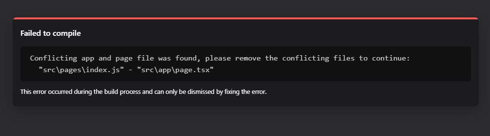

This is a [Next.js](https://nextjs.org/) project bootstrapped with [`create-next-app`](https://github.com/vercel/next.js/tree/canary/packages/create-next-app).

## Getting Started

First, run the development server:

```bash
npm run dev
# or
yarn dev
# or
pnpm dev
```

Open [http://localhost:3000](http://localhost:3000) with your browser to see the result.

You can start editing the page by modifying `app/page.tsx`. The page auto-updates as you edit the file.

This project uses [`next/font`](https://nextjs.org/docs/basic-features/font-optimization) to automatically optimize and load Inter, a custom Google Font.

## Learn More

To learn more about Next.js, take a look at the following resources:

- [Next.js Documentation](https://nextjs.org/docs) - learn about Next.js features and API.
- [Learn Next.js](https://nextjs.org/learn) - an interactive Next.js tutorial.

You can check out [the Next.js GitHub repository](https://github.com/vercel/next.js/) - your feedback and contributions are welcome!

## Deploy on Vercel

The easiest way to deploy your Next.js app is to use the [Vercel Platform](https://vercel.com/new?utm_medium=default-template&filter=next.js&utm_source=create-next-app&utm_campaign=create-next-app-readme) from the creators of Next.js.

Check out our [Next.js deployment documentation](https://nextjs.org/docs/deployment) for more details.


1. 在新版本的nextjs中,如果在pages下新增一个index.js作为主文件，此时会有冲突.需要删除一个


2. 动态路由情况下,优先匹配精确的路由,比如product/sweater

3. 路由分为普通路由,嵌套路由,动态路由,嵌套动态路由,catch all routes等

4. router的push和replace方法的区别？

## route summary

1. Page based routing machanism - Pages are associated with a route based on their file name.  

2. Nested routes -- nested folder structure, files will be automatically routed in the same way in the URL.  

3. Dynamic routes -- Can be created by adding square brackets to a page name.  

4. Catch All routes -- Add three dots inside square brackets to create a catch all routes.  
