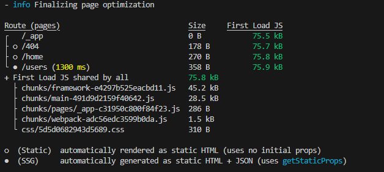

# 编译中的信息理解：

1. 
    上面的编译信息代表的意思理解透彻  
2. 理解.next文件夹下的server目录下的page和static目录下的page文件之间区别:一个需要发往浏览器,另一个不需要发往浏览器.  

3. Link组件会触发需要的json数据的下载,也就是提前预加载.json数据用于next/link或者next/router,这些数据实际上作为
    getStaticProps的预加载,作为组件的props属性来使用

4. getStaticPaths数据太多的时候会导致编译错误,比如加载100个post页面,同时理解这个函数的返回参数fallback为false,true,'blocking'的作用和使用场景,

5. 一个jsonAPI: https://jsonplaceholder.typicode.com/
